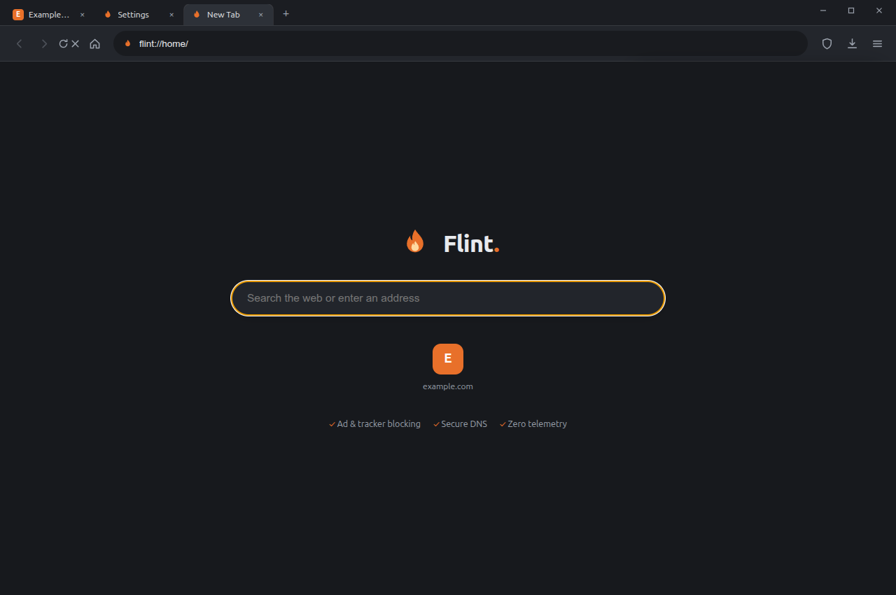
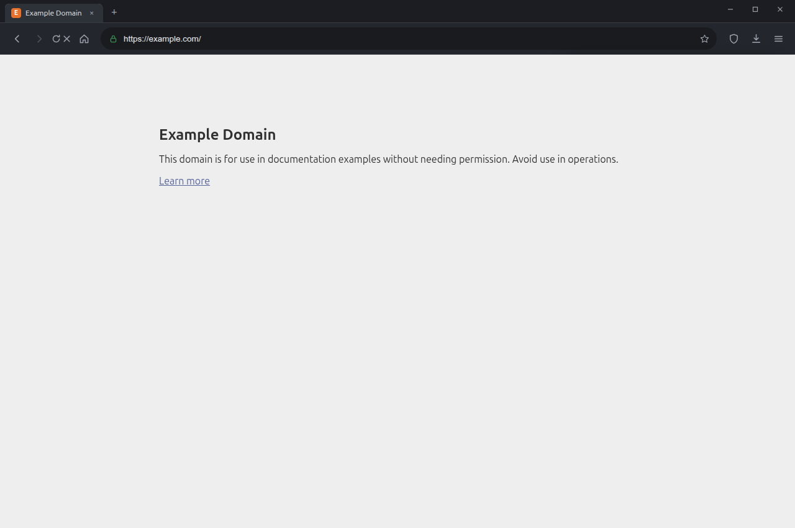
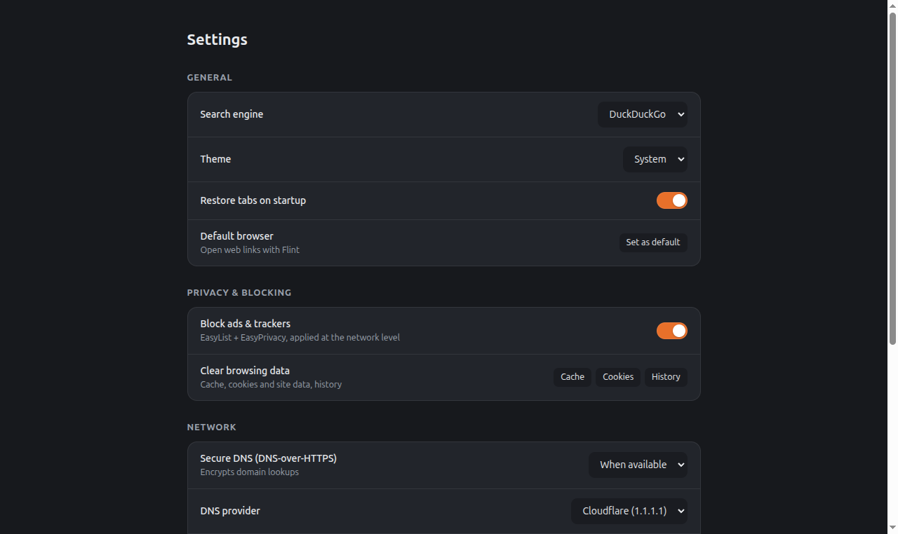

<p align="center">
  
</p>

<h1 align="center">Flint Browser</h1>

<p align="center">
  <b>Fast, private, batteries included.</b><br>
  A desktop web browser by <a href="https://github.com/Dhiva-Labs">Dhiva Labs</a> with ad &amp; tracker blocking,
  secure DNS, turbo downloads and reader mode built in — and zero telemetry.
</p>



## Features

- **Built-in ad & tracker blocking** — EasyList + EasyPrivacy applied at the network level (not an extension), with a per-site toggle and live blocked counters on every tab.
- **Secure DNS (DNS-over-HTTPS)** — one click to encrypt your DNS lookups via Cloudflare, Quad9, Google, AdGuard or your own resolver.
- **Turbo downloads ⚡** — Flint's own multi-connection segmented downloader with pause/resume, right in the download manager (right-click any link → *Turbo Download Link*).
- **Reader mode** — distraction-free article view (Ctrl+Alt+R) with font and sepia/dark controls.
- **Private windows** — fully ephemeral sessions (Ctrl+Shift+N), with blocking still active.
- **HTTPS-first** — typed addresses try HTTPS before HTTP; strict HTTPS-only mode available.
- **Everything a browser needs** — tabs with reopen-closed, omnibox with history/bookmark suggestions, bookmarks, history, downloads, find-in-page, zoom, print, session restore, custom search engine (DuckDuckGo default).
- **Zero telemetry** — Flint sends nothing, anywhere. No analytics, no crash uploads, no phone-home.

| Browsing | Settings |
|---|---|
|  |  |

## Install

### Ubuntu / Debian (PPA)

```bash
sudo add-apt-repository ppa:dhiva-labs/apps
sudo apt update
sudo apt install flint-browser
```

### Direct download

Grab the latest `.deb`, `.AppImage` or `.tar.gz` from
[Releases](https://github.com/Dhiva-Labs/FlintBrowser/releases).

```bash
sudo apt install ./flint-browser-1.0.0-amd64.deb
```

The AppImage needs no installation: `chmod +x` and run.

## Build from source

```bash
git clone https://github.com/Dhiva-Labs/FlintBrowser.git
cd FlintBrowser
npm install
npm run build:engine   # compile the adblock engine from EasyList/EasyPrivacy
npm run build:icons
npm start
```

Tests: `npm test` (unit) and `npm run smoke` (full in-app smoke suite with
real navigation, adblock verification and a segmented-download check).

Release artifacts: `npm run dist` → `dist/`.

## Architecture

Flint is an Electron app: every tab is an isolated, sandboxed Chromium
`WebContentsView`; the UI chrome is its own view stacked above them. Blocking
happens in the network layer via the Ghostery filters engine with a prebuilt
binary engine snapshot, so it works offline from first launch. Internal pages
live on the privileged `flint://` scheme (`flint://settings`,
`flint://downloads`, `flint://history`, `flint://bookmarks`, `flint://about`).

## Privacy

Flint has **no server side**. Your history, bookmarks and settings stay in
`~/.config/flint-browser`. The only network requests Flint itself makes are
the ones you ask for (page loads, downloads, DoH lookups to the resolver you
chose).

## Roadmap

- Cosmetic filtering (hiding ad placeholders)
- Bookmarks bar and folders
- Windows build
- Android companion (separate codebase)

## License

[MIT](LICENSE) © Dhiva Labs · See [THIRD_PARTY_NOTICES](THIRD_PARTY_NOTICES.md)
for bundled open-source components.
